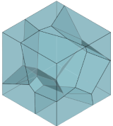

# Website do Quebra-Cabeça Voronoi
O Quebra-Cabeça Voronoi é um projeto desenvolvido durante a disciplina MAP2001 - Matemática, Arquitetura e Design, no primeiro semestre de 2022. A disciplina é ministrada na Universidade de São Paulo (USP) com professores do Instituto de Matemática e Estatística (IME) junto a docentes da Faculdade de Arquitetura e Urbanismo (FAU).

## Sobre o projeto
A proposta é desenvolver, em grupos, um objeto que represente alguma conexão entre Matemática, Arquitetura e Design, revelando uma natureza interdisciplinar. Este projeto foi desenvolvido por três alunos de diferentes institutos:

- Daniela Gonzalez Favero (IME)
- Gabrielle Mendes de Souza Delgado (FAU)
- Guilherme Sanches Ribeiro (FAU)

As prospecções em grupo levaram ao desenvolvimento de um quebra-cabeça tridimensional que obedece à regra matemática de Voronoi para a delimitação das regiões. Como material complementar, de modo a evidenciar a interação do real com o virtual nos jogos da atualidade, desenvolveu-se um website com informações educativas e a solução do quebra-cabeça.

O site pode ser acessado em [cubo-voronoi.herokuapp.com](https://cubo-voronoi.herokuapp.com).

[](https://cubo-voronoi.herokuapp.com)

## Informações técnicas
Aceitamos contribuições para a melhora e manutenção do projeto!

O site utiliza [Flask](https://flask.palletsprojects.com/en/2.1.x/) e pode ser rodado localmente com o seguinte comando:
```
flask run
```

A plataforma é deployada com [Heroku](https://heroku.com).